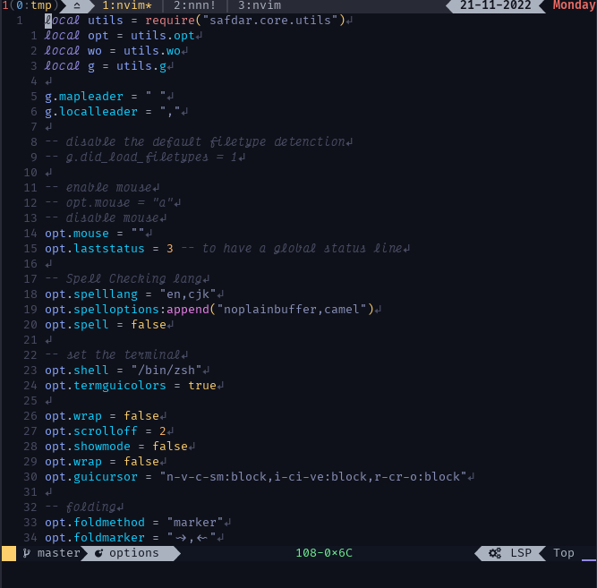
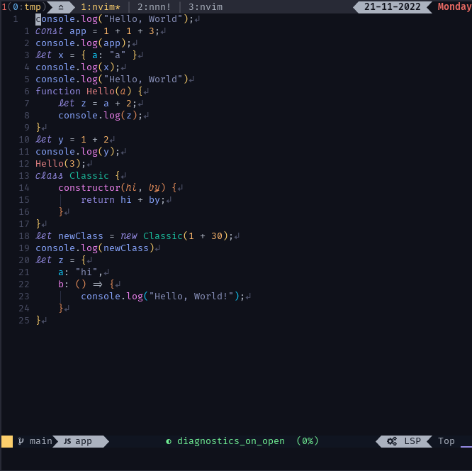
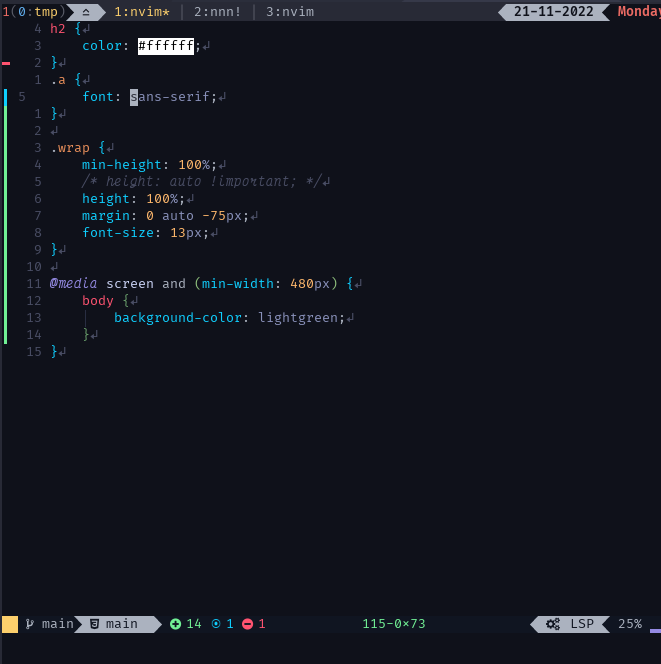
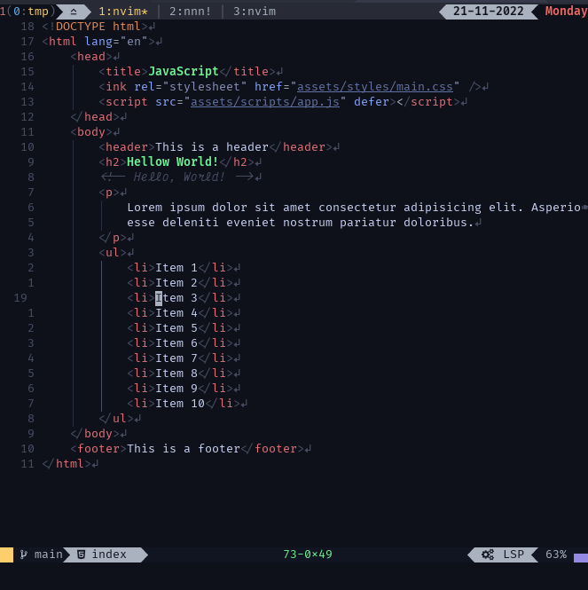
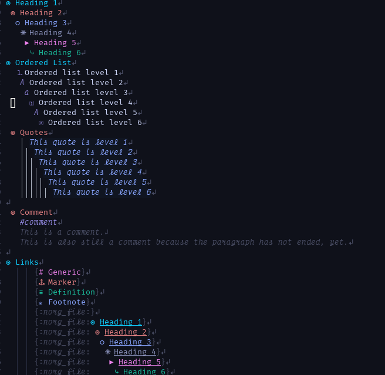
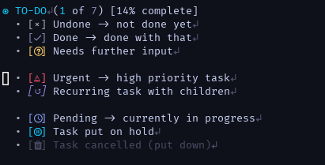
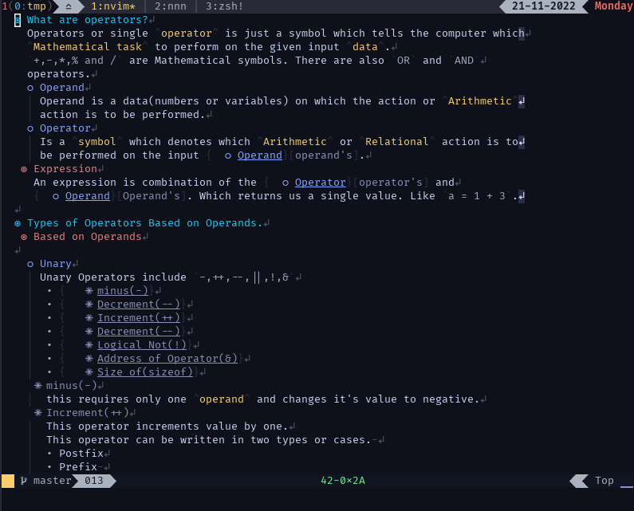
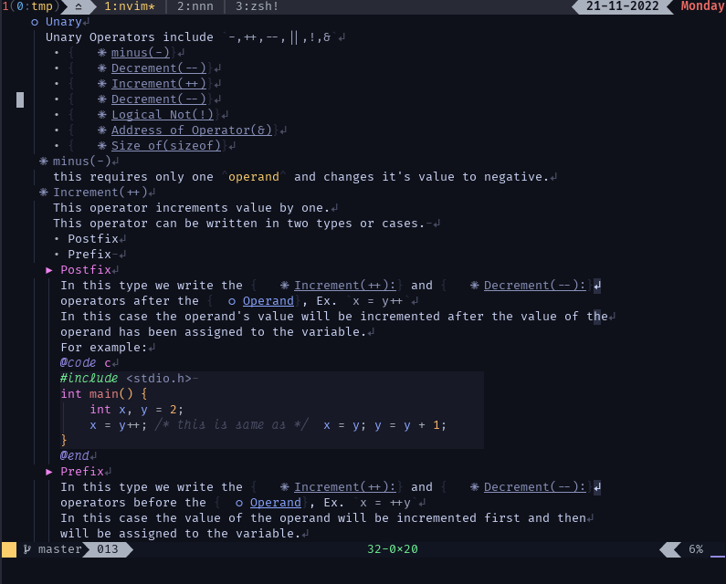
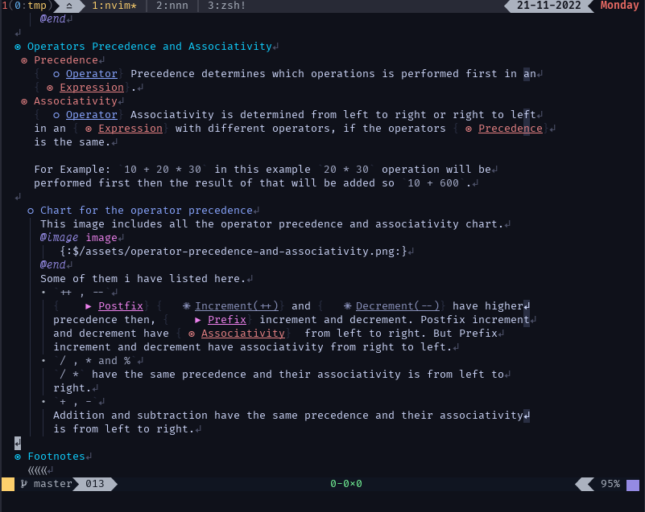

# fused.nvim

> <a style="color: Yellow;">NOTE</a>: This plugin is under development i have yet to
> implement a lot of features but feel free to use it.

A 🌈 colorscheme fused between different color schemes

You can install this theme using any plugin manager you use:

Using Plug

```vim
Plug 'TheSafdarAwan/fused.nvim'
```

Using packer

```lua
use({ "TheSafdarAwan/fused" })
```

## lua



## javascript



## css



## html



## Neorg




##### Some notes written in neorg

<details>
<summary>Click here to expand notes pictures</summary>



</details>

### ⚙️ Configuration:

```lua
require("fused").setup({
        -- currently only one flavour is available but Pr is welcome
        flavour = "dark",
        --[[
        Enable these plugins if not then set it to false or remove the whole table
        and set the plugins_integration to false.
        ]]
        plugins_integration = {
        -- @names of the plugins
        cmp = true,
        diffview = true,
        harpoon = true,
        indentblankline = true,
        lspsaga = true,
        neorg = true,
        nvimtree = true,
        telescope = true,
        todocomments = true,
        trouble = true,
        tsrainbow = true,
        },
        custom = {
            --[[
                Add you custom highlights here by adding the highlight group name as key and providing a table as its value for its
                    Configuration.
            ]]
        },
})
```

### custom highlights example

```lua
require("fused").setup({
        custom = {
            --[[ You can specify the setting for the highlight groups same as you
            would using the `vim.api.nvim_set_hl` function. ]]

            --[[ This LineNr group highlights the line numbers you can change it to
            whatever you wan't.
            But don't do it like here i am doing it's just an example. ]]
            LineNr = { fg = "Red", bg = "Gray", italic = true, bold = false},
        }
    })
```

I have this autocmd which i got from the **Damian Conway** from his vim [talk](https://youtu.be/aHm36-na4-4?t=245) to highlight line like the `:h colorcolumn`
but it only highlights it if it exceeds the 81 character limit.

```lua
local autocmds_augroup =
api.nvim_create_augroup("autocmds.lua", { clear = true })
create_autocmd({ "BufEnter" }, {
    group = autocmds_augroup,
    command = "call matchadd('DamianConway', '\\%80v')",
})
```

So to color this new group that I named `DamianConway` i can add the following
option inside the `fused.nvim` config.

```lua
require("fused").setup({
        custom = {
                DamianConway = { bg = "Gray" }
        }
    })
```

## ⚙️ Font's Configuration:

I am using two font's `Victor Mono Nerd Font` for italic's font and `FiraCode Nerd Font` for normal font.

#### wezterm

I use [wezterm](https://github.com/wez/wezterm/) terminal so here is my configuration

<details>
<summary>Click to Expand</summary>

```lua
-- add these variables and function on top of wezterm.lua
local italic_font = "Victor Mono Nerd Font"
local normal_font = "FiraCode Nerd Font"
local default_font_name = normal_font
local function font_with_fallback(name, params)
    local names = { name, "Apple Color Emoji", "azuki_font" }
    return font_with_fallback(names, params)
end

return {
    -- Add this into your wezterm config
    font_size = 10.0,
    font = font_with_fallback(default_font_name),
    font_rules = {
        {
            italic = true,
            font = font_with_fallback(italic_font, { italic = true }),
        },
        {
            italic = true,
            intensity = "Bold",
            font = font_with_fallback(
                italic_font,
                { italic = true, bold = true }
            ),
        },
        {
            italic = false,
            intensity = "Normal",
            font = font_with_fallback(
                default_font_name,
                { weight = "Regular", italic = false }
            ),
        },
    },
}
```

</details>

## TO-DO

- Add more flavors
- Add Highlights
  - Neogit
  - Diffview
  - Packer
  - cmp(add the remaining highlights)
  - vim-matchup
- Add the style option

## Contribution

Well i created this theme on my own. If you want to contribute then create a PR. I
would love that.
